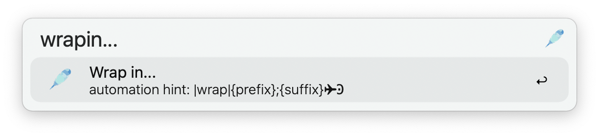

  <h1>
     
    Quill | Text processing utility 
    
  </h1>

Quill is a text processing utility for automation that interfaces with Alfred. Currently, **87 commands** are available, many of which can be combined to achieve more complex modifications.

## Usage Note

The workflow has five entry points. When...
- Using the **keyword** (default: ` v `), the clipboard is processed.
- Using the **main Universal Action**, the text that is passed to it is processed.
- Using the **main shortcut** (default: `⌃+⌥+⌘+#`), the text of your selection in macOS is processed.
- Using **custom shortcuts**, the text of your selection in macOS is processed.
- Using **custom Universal Actions**, the text that is passed to them is processed.

When using the *main shortcut*, the transformed text is always pasted to the frontmost application. Whether the transformed text will be pasted when using the other entry points depends on your choice in the *Workflow Configuration*, or on a case-by-case basis for your custom implementations. Hold **⌘** on the main Universal Action to ensure that the transformation result is just copied to the clipboard.

When you use the keyword or one of the main entry points, you will always be presented with all available transforms. These are filtered as you begin typing. Setting up custom entry points allows you to directly invoke the commands you want (see `Automation`).

Expand to watch the preview

## Dynamic Transforms

The following commands are *dynamic*, which means they allow you to be more specific about what you want them to do. Although they require additional input to work, you can still automate them by constructing their correct **trigger sequences** (see `Automation Hints` and `Dynamic Automation`; note that the workflow also includes some examples).

- Replace occurrences of... with...
- Remove lines containing...
- Keep lines containing...
- Remove... 
- Prepend...
- Wrap in...

**Bonus:** The commands `Replace` and `Remove` accept regular expressions.

## Basic Transforms

The majority of the commands are *static*, which means that they are hard-coded to complete a specific text processing task. For a full list see `Appendix: Commands`. Two of these commands have a special requirement:
- Word Segmentation
- Fix Letterspaced Words

For these to work, you have to provide a lexicon or vocabulary as a plain text file with valid words separated by newlines.

### Noteworthy Command Behavior

- **Repeat Last Command:** Can be triggered by typing ` ! `
- **Swap Words**: Splits the input at the first encountered whitespace into LHS and RHS, which then swap places.
- **Create Markdown Link**: Creates a markdown formatted link from your current selection by combining it with the most recent URL from your clipboard, or the most recent non-URL text if the selection is a URL. Note that this command does not work when invoked with the keyword.
- **Statistics**: The command presents the statistics of the provided text in a dialog.

## Automation

All of the commands can be configured to trigger with a *Hotkey* or *Universal Action*. This allows you to quickly access the commands you use most. Commands can also be chained to create customized text processing pipelines. For text processing tasks that don't take advantage of a specialized *Quill* feature, Alfred provides useful utilities out of the box. [^1] [^2]

You can find examples within the workflow at the bottom of the canvas.

### Automation Hints

Holding the **⌘** key while focusing a command shows you its *automation hint*. You can copy this sequence with **⌘+C**, which can be used to set up shortcuts and Universal Actions. Note the trailing `Ͽ` symbol and that it is required for all automation sequences that are triggered with a shortcut.

### Basic Automations

### Dynamic Automations

Note that when you copy the automation hint for dynamic commands, the *Delimiter* and *Trigger*  symbols will be resolved. That is, with the default configuration values left in place, you will get, for instance: 
- `|wrap|{prefix};{suffix}✈Ͽ`. 

If you want to make sure that your automations survive changes of the *Delimiter* and *Trigger* symbols, you can reference them as configuration variables directly: 
- `|wrap|{your prefix}{var:delim}{your suffix}{var:trigger}Ͽ`.

**Important:** Do not change the variable names `delim` and `trigger`

## Configuration

To access some internal configuration options, type ` :c `.

- **Always paste to frontmost application:** If this option is not checked, the processed text (taken from the clipboard) will be copied to your clipboard **if** the workflow is triggered with the `keyword`. Transformations triggered using a shortcut will always be pasted.

- **Ignore recurring requests:** If this option is checked, the workflow will not trigger if the input has already been seen and processed recently. Otherwise, the workflow will be triggered when browsing Alfred's history, which may not be intended.

- **Locale:** Specifying a *RFC-5646 language tag* here will change the number formatting and the results for commands such as *Spell out numbers*.

- **Lexicon:** You can provide the path to a text file with newline-separated valid words to enable *word segmentation* and *fixing letterspaced words*. If you don't provide a lexicon then opting in to use those commands has no effect. 

---

## Appendix: Commands

### Dynamic Commands

- Remove Lines Containing Insensitive...
- Keep Lines Containing Insensitive...
- Replace occurrences of... with...
- Remove lines containing...
- Keep lines containing...
- Prepend...
- Wrap in...
- Remove... 

### Static Commands

Expand to see all available static commands

-  Make List
-  Shift Left
-  Title Case
-  Remove List
-  Shift Right
-  URL Encoded
-  URL Decoded
-  Extract URLs
-  Remove Quotes
-  LaTeX Encoded
-  LaTeX Decoded
-  Romanize Text
-  Extract Dates
-  Base64 Encode
-  Base64 Decode
-  Markdown to RTF
-  Markdown to HTML
-  Increment Number
-  Lowercase Letters
-  Uppercase Letters
-  Extract Addresses
-  Word Segmentation
-  Remove All Numbers
-  Reverse Line Order
-  " Wrap in Quotes "
-  \`Wrap in Backticks\`
-  Normalize Diacritics
-  LaTeX Encoded (full)
-  LaTeX Decoded (full)
-  Escape Double Quotes
-  ( Wrap in Brackets )
-  Extract Phone Numbers
-  Fix File Name (Smart)
-  Smart Quotation Marks
-  Fix Letterspaced Words
-  Trim Leading Whitespace
-  Extract Email Addresses
-  Sort by count ascending
-  Fix Umlauts (Diaeresis)
-  Repeat with Last Command
-  Trim Trailing Whitespace
-  Sort by count descending
-  Straight Quotation Marks
-  ' Wrap in Single Quotes '
-  < Wrap in Angle Brackets >
-  { Wrap in Curly Brackets }
-  Remove Leading Line Numbers
-  [ Wrap in Square Brackets ]
-  Remove Whitespace Characters
-  Escape Whitespace Characters
-  Romanize Text (No Diacritics)
-  Sort alphabetically ascending
-  Remove Newlines (Line Endings)
-  Convert URLs to Markdown Links
-  Sort alphabetically descending
-  Remove All Whitespace Characters
-  Replace Newlines with Whitespace
-  Remove Multiple Newline Characters
-  Initial caps of words (capitalize)
-  Replace Underscores with Whitespace
-  Trim Leading and Trailing Whitespace
-  Remove Duplicate Lines (ignore case)
-  Remove Multiple Whitespace Characters
-  Remove Duplicate Lines (literal compare)
-  Remove Duplicate Lines (ignore diacritics)
-  Remove Duplicate Lines (ignore whitespace)
-  Replace Dashes and Hyphens with Whitespace
-  Fix words broken by end-of-line hyphenation
-  NFD - Normalization Form Canonical Composition
-  Remove Duplicate Lines (ignore diacritics and case)
-  NFKD - Normalization Form Compatibility Decomposition
-  Replace Dashes, Hyphens and Underscores with Whitespace
-  Remove Duplicate Lines (ignore diacritics, case and whitespace)
-  NFC - Normalization Form Canonical Decomposition + Canonical Composition
-  NFKC - Normalization Form Compatibility Decomposition + Canonical Composition

[^1]: [Alfred: Manipulate selected text](https://www.alfredapp.com/blog/tips-and-tricks/manipulating-selected-text-in-macos-with-alfred-workflows/)  
[^2]: [Alfred: Transform utility](https://www.alfredapp.com/help/workflows/utilities/transform/)